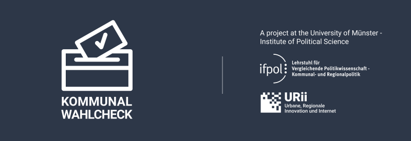

# Kommunalwahlcheck 2020 Documentation

> A voting advice application (VAA) or election compass is a Web application that helps voters find a candidate or a party that stands closest to their preferences.

We have prepared 30 statements for the upcoming municipal elections in Münster, North Rhine-Westphalia, and asked the participating parties and mayoral candidates about their positions and arguments. Almost all of them have provided comprehensive answers. Who advocates for your political views? Use our VAAs to find out. **Try it** ✨

- **[Münster](https://muenster.kommunalwahlcheck.de)**
- **[Bielefeld](https://bielefeld.kommunalwahlcheck.de)**
- Essen
- Köln
- Siegen

---

### Imprint
[Imprint >](imprint.md)

### Privacy Policy
[Privacy Policy >](privacy.md)

### Attributions
[Attributions >](attributions.md)

### FAQ
[Frequently Asked Questions >](https://www.uni-muenster.de/IfPol/Kersting/online-wahlhilfe/Kommunalwahlcheck-FAQ.html)

### Statements and positions
**Statements** ("theses") were assembled by [Prof. Kersting's team](https://www.uni-muenster.de/IfPol/Kersting/URII/) at the University of Muenster Institute of Political Science.\
**Positions** were voluntarily sent in upon the team's request by parties and candidates participating in the upcoming election.

### Changelog
|city|latest stable|date|
|-|-|-|
|Münster|v1.15|2020-08-31 21:20|
|Bielefeld|v1.0|2020-08-31 21:30|
|Essen|wip|||
|Köln|wip|||
|Siegen|wip|||

---

### Open Election Compass
GNU General Public License v3.0\
Source code is available at\
[https://github.com/open-election-compass/client](https://github.com/open-election-compass/client)

👏 Shout-out to the Open Election Compass project, we couldn't have done it without their dedicated coding!

---

###### Kommunalwahlcheck 2020 is a project at the University of Münster - Institute of Political Science